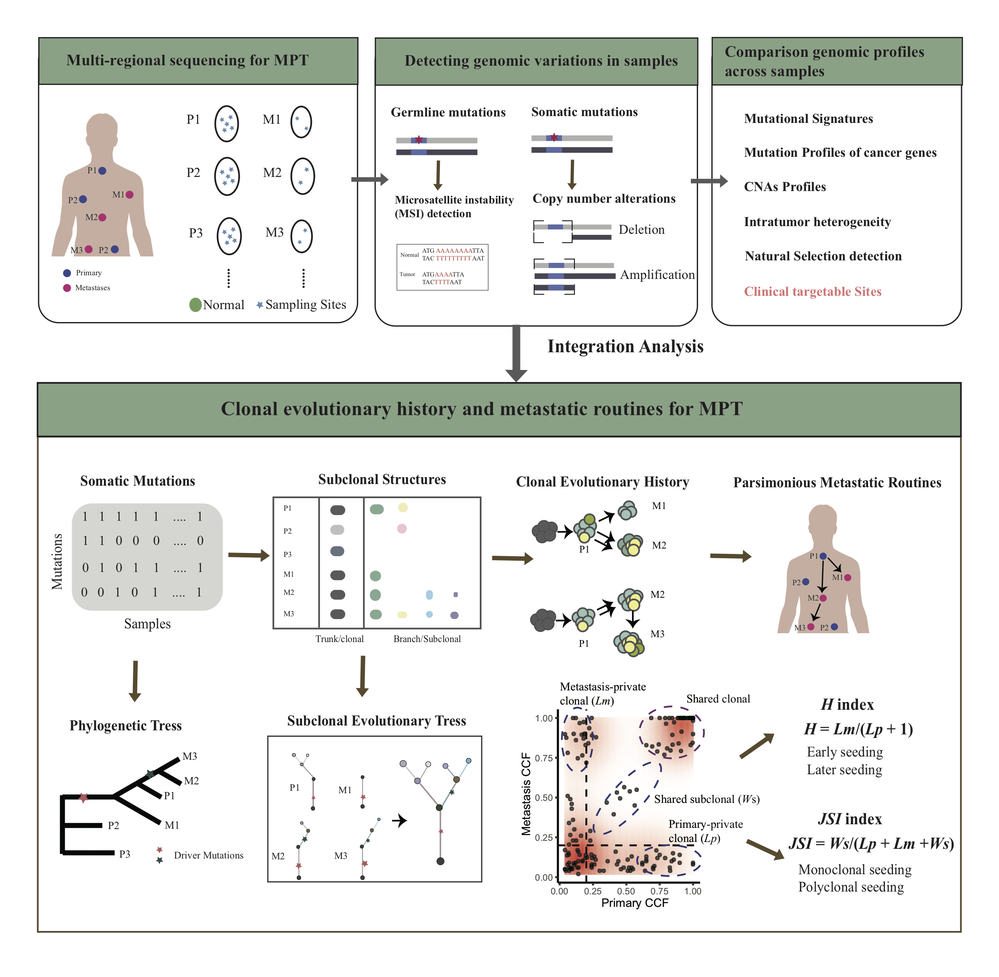

### MPTevol

Multiple primary tumors(MPT) is a kind of special and rare cancer, defined as more than two primary tumors presenting at the diagnosis in a single patient. To date, the molecular characteristics and tumorigenesis for MPT remain unclear, which are mainly attributed to insufficient approaches in methodology. Here, we present MPTevol, a practical computational framework for a comprehensive exploration of the MPT from multiregional genomic sequencing experiments. The MPTevol consists of multiple modules that can assist in comparison genomic profiles across samples, detecting clonal evolutionary history and metastatic routines, and quantifying the metastatic history for MPT.

The overview of the **MPTevol** model is shown below:

### Reference:
Comprehensive deciphering clonal dynamics and metastatic routines in a rare patient of synchronous triple primary tumors and multiple metastases with MPTevol.

