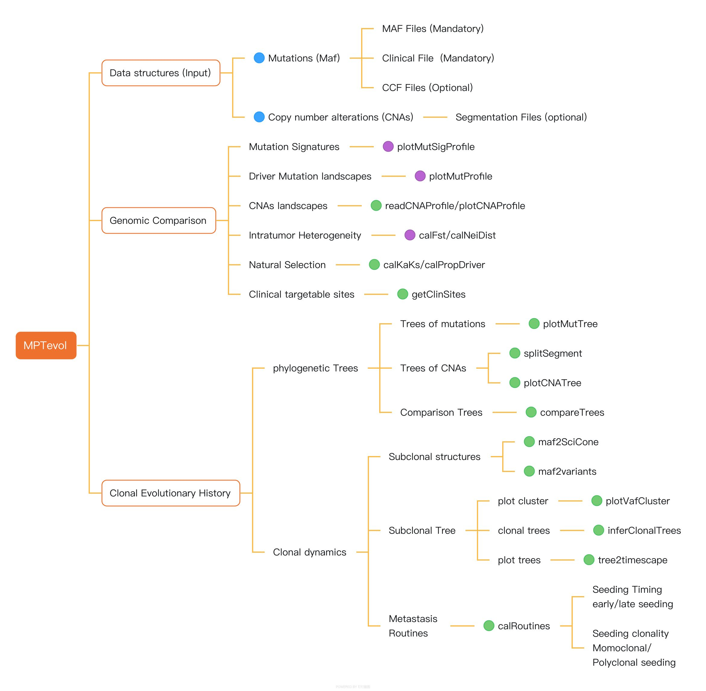

<!-- README.md is generated from README.Rmd. Please edit that file -->

# MPTevol

<!-- badges: start -->
<!-- badges: end -->

The goal of MPTevol is to provide a practical computation framework for
dissecting the evolution of multiple primary tumors (MPT), reducing
analysis complexity with modular design.

**Package Overview**:


If you are using the MPTevol in academic research, please cite our
paper:

***Deciphering clonal dynamics and metastatic routines in a rare patient
of synchronous triple primary tumors and multiple metastases with
MPTevol.***

## Installation

You can install the development version of MPTevol from
[GitHub](https://github.com/) with:

``` r
# install.packages("remotes")
remotes::install_github("qingjian1991/MPTevol")
```

## Documentation

The overview of usage could be found at [MPTevol online
vignette](https://rpubs.com/cqj_00/MPTevol).

## Package structure



## Authors

This software is developed by:

-   Qingjian Chen, <chenqingjian2010@163.com>, Sun Yat-Sen Univerity
    Cancer Center.
-   Shixiang Wang, <w_shixiang@163.com>, Sun Yat-Sen Univerity Cancer
    Center.

## Supervised by

-   [Qi Zhao](zhaoqi@sysucc.org.cn) from Bioinformatic Center of Sun
    Yat-sen University Cancer Center.
